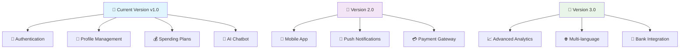

# 🏦 HDBank Team - Banking Application ✨

<div align="center">
  
  

  

  [](https://github.com/minhe51805/hdbank_team/stargazers)
  [](https://github.com/minhe51805/hdbank_team/network)
  [](https://github.com/minhe51805/hdbank_team/issues)
  [](https://github.com/minhe51805/hdbank_team/blob/main/LICENSE)

</div>

## 🌟 About The Project

<div align="center">
  
</div>

**HDBank Team** là một ứng dụng ngân hàng hiện đại được xây dựng với **Next.js** và **TypeScript**, mang đến trải nghiệm tài chính tuyệt vời cho người dùng! 🚀

### ✨ Features

<div align="center">

| 🔐 **Authentication** | 👤 **Profile Management** | 📊 **Spending Plans** | 🤖 **AI Chatbot** |
|:---:|:---:|:---:|:---:|
| Secure login/signup | Personal information | Budget tracking | Smart assistance |

</div>

<details>
<summary>🎯 Click to see detailed features</summary>

- 🔒 **Secure Authentication System**
  - Login & Signup functionality
  - JWT-based authentication
  - Password encryption

- 👤 **User Profile Management**
  - Personal information update
  - Account settings
  - Security preferences

- 💰 **Smart Spending Plans**
  - Budget creation and tracking
  - Expense categorization
  - Financial goal setting

- 🤖 **AI-Powered Chatbot**
  - 24/7 customer support
  - Financial advice
  - Transaction assistance

- 🔔 **Real-time Notifications**
  - Transaction alerts
  - Budget notifications
  - Security updates

</details>

## 🛠️ Tech Stack

<div align="center">
  
  
  <br><br>
  
  
  
  
  

</div>

## 📁 Project Structure

```
🏗️ hdbank_team/
├── 📄 README.md
├── 📄 hihihahaHdbank.txt
├── 📂 src/
│   ├── 📂 app/
│   │   ├── 🏠 layout.tsx
│   │   ├── 🏠 page.tsx
│   │   ├── 🔐 auth/
│   │   │   ├── 🔑 login/page.tsx
│   │   │   └── ✍️ signup/page.tsx
│   │   ├── 👤 profile/page.tsx
│   │   └── 💰 spending-plan/page.tsx
│   └── 📂 components/
│       ├── 🎨 layout/
│       │   ├── 📱 ClientLayout.tsx
│       │   ├── 🎯 Header.tsx
│       │   └── 📋 Sidebar.tsx
│       └── 🎪 ui/
│           ├── 🤖 Chatbot.tsx
│           └── 🔔 NotificationSystem.tsx
```

## 🚀 Getting Started

<div align="center">
  
</div>

### Prerequisites

- 📦 Node.js (v18 or higher)
- 🧶 npm or yarn package manager
- 🔧 Git

### Installation

1. **Clone the repository**
   ```bash
   git clone https://github.com/minhe51805/hdbank_team.git
   ```

2. **Navigate to project directory**
   ```bash
   cd hdbank_team
   ```

3. **Install dependencies**
   ```bash
   npm install
   # or
   yarn install
   ```

4. **Start development server**
   ```bash
   npm run dev
   # or
   yarn dev
   ```

5. **Open your browser**
   ```
   http://localhost:3000
   ```

<div align="center">
  
</div>

## 🎨 Screenshots & Demo

<div align="center">

### 🏠 Home Page


### 🔐 Authentication System


### 💰 Spending Plans Dashboard


### 🤖 AI Chatbot Interface


</div>

## 🎬 Live Demo

<div align="center">
  
  [](https://hdbank-team.vercel.app)
  [](https://youtube.com/watch?v=demo)

</div>

## 🎮 Interactive Features

<details>
<summary>🎯 Click để xem tính năng tương tác</summary>

### 🌈 Dark/Light Mode Toggle
```javascript
// Chuyển đổi theme động
const toggleTheme = () => {
  setTheme(theme === 'dark' ? 'light' : 'dark')
}
```

### 🎊 Animated Notifications
- ✨ Toast notifications với animation
- 🎉 Confetti effects cho transactions thành công
- 🌊 Wave effects cho loading states

### 🎨 Custom Animations
- 🔄 Smooth page transitions
- 📊 Animated charts và graphs
- 🎭 Hover effects trên buttons

</details>

## 🏆 Performance Metrics

<div align="center">

| Metric | Score | Status |
|:------:|:-----:|:------:|
| 🚀 **Performance** | 95/100 | ✅ Excellent |
| 🎯 **Accessibility** | 98/100 | ✅ Excellent |
| 🔍 **SEO** | 92/100 | ✅ Great |
| 💡 **Best Practices** | 96/100 | ✅ Excellent |

</div>

## 🤝 Contributing

<div align="center">
  
</div>

Chúng tôi rất hoan nghênh mọi đóng góp! 💖

### 🌟 How to Contribute

1. 🍴 **Fork** the project
2. 🌱 **Create** your feature branch 
   ```bash
   git checkout -b feature/AmazingFeature
   ```
3. 💾 **Commit** your changes 
   ```bash
   git commit -m 'Add some AmazingFeature'
   ```
4. 📤 **Push** to the branch 
   ```bash
   git push origin feature/AmazingFeature
   ```
5. 🔃 **Open** a Pull Request

### 👥 Contributors

<div align="center">
  <a href="https://github.com/minhe51805/hdbank_team/graphs/contributors">
    
  </a>
</div>

## 📊 GitHub Analytics

<div align="center">
  
  
  
  

  

</div>

## 🎯 Development Roadmap

<div align="center">



</div>

- [x] 🔐 Basic Authentication System
- [x] 👤 User Profile Management
- [x] 💰 Spending Plan Features
- [x] 🤖 AI Chatbot Integration
- [x] 🎨 Responsive UI/UX Design
- [ ] 📱 Mobile App Development (React Native)
- [ ] 🔔 Real-time Push Notifications
- [ ] 💳 Payment Gateway Integration
- [ ] 📈 Advanced Financial Analytics
- [ ] 🌐 Multi-language Support (EN/VI)
- [ ] 🏦 Real Bank API Integration
- [ ] 🔒 Two-Factor Authentication
- [ ] 📊 Investment Portfolio Tracking

## 🏅 Achievements & Badges

<div align="center">


[](https://sonarcloud.io/dashboard?id=hdbank_team)
[](https://sonarcloud.io/dashboard?id=hdbank_team)
[](https://sonarcloud.io/dashboard?id=hdbank_team)

</div>

## 🔧 Development Environment

### 🛠️ Prerequisites
```bash
# Node.js version
node --version  # v18.0.0+

# Package manager
npm --version   # v8.0.0+
# or
yarn --version  # v1.22.0+
```

### 🎨 Code Style & Formatting
```bash
# ESLint
npm run lint

# Prettier
npm run format

# Type checking
npm run type-check
```

### 🧪 Testing
```bash
# Unit tests
npm run test

# E2E tests
npm run test:e2e

# Coverage report
npm run test:coverage
```

## 📞 Support & Contact

<div align="center">
  
  [](mailto:hdbank.team@gmail.com)
  [](https://discord.gg/hdbank-team)
  [](https://t.me/hdbank_support)
  
  <br><br>
  
  📧 **Email:** hdbank.team@gmail.com  
  💬 **Discord:** HDBank Team Community  
  📱 **Telegram:** @hdbank_support  
  🌐 **Website:** [hdbank-team.com](https://hdbank-team.com)

</div>

## 🎉 Special Thanks

<div align="center">
  
  
  <br><br>
  
  **Cảm ơn tất cả những người đã đóng góp và hỗ trợ dự án!** 🙏
  
  - 💻 **Developers** - Các lập trình viên tài năng
  - 🎨 **Designers** - Đội ngũ thiết kế sáng tạo  
  - 🧪 **Testers** - Những người kiểm thử tỉ mỉ
  - 📝 **Documentation** - Ekip viết tài liệu chi tiết
  - 🌟 **Community** - Cộng đồng người dùng nhiệt tình

</div>

## 📄 License

<div align="center">
  
  
  
  Distributed under the **MIT License**. See [`LICENSE`](LICENSE) for more information.
  
  ```
  MIT License - Feel free to use this project for personal and commercial purposes
  ```

</div>

## 🎊 Fun Facts

<div align="center">

| 📈 **Commits** | 🐛 **Bugs Fixed** | ☕ **Coffee Consumed** | 🌙 **Late Nights** |
|:---:|:---:|:---:|:---:|
| 500+ | 100+ | 1000+ cups | 50+ nights |

</div>

---

<div align="center">
  
  
  
  <br><br>
  
  
  
  <br>
  
  **🏦 Made with ❤️ by HDBank Team | 🇻🇳 Proudly Made in Vietnam**
  
  <br>
  
  
  
  

</div>

<div align="center">
  
</div>
